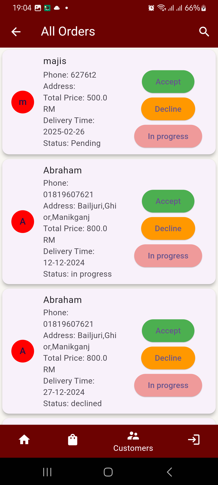

# E-commerce Admin Panel App

## 📌 Overview
The **E-commerce Admin Panel App** is a Flutter-based mobile application designed to help administrators manage products, orders, and users efficiently. This app integrates **Firebase** for real-time database updates, authentication, and cloud storage.

## 🚀 Features
- 🔑 **Admin Authentication** (Secure login with Firebase Auth)
- 🛍 **Product Management** (Add, Edit, Delete Products)
- 📦 **Order Management** (View, Update Order Status)
- 👥 **User Management** (View & Manage Users)
- 📊 **Analytics Dashboard** (Sales Reports, Revenue Stats)
- 🔔 **Push Notifications for Order Updates**

## 🖥 Tech Stack
- **Frontend:** Flutter, Dart
- **Backend:** Firebase (Authentication, Firestore, Cloud Storage, Cloud Functions)
- **State Management:** Provider / Riverpod / GetX
- **Other Tools:** Git, REST API, Firebase Cloud Messaging (FCM)

## 📸 Screenshots





## 🛠 Setup & Installation
1. Clone the repository:
   ```sh
   git clone https://github.com/sbfrusho/UTM_admin_panel_new.git
   cd UTM_admin_panel_new
   ```
2. Install dependencies:
   ```sh
   flutter pub get
   ```
3. Configure Firebase:
   - Create a Firebase project.
   - Enable Authentication, Firestore, and Storage.
   - Download and place `google-services.json` (Android) & `GoogleService-Info.plist` (iOS) in respective directories.
4. Run the app:
   ```sh
   flutter run
   ```

## 💡 Challenges & Solutions
### 🔄 Real-time Data Management
- **Issue:** Ensuring order and product updates reflect instantly.
- **Solution:** Used Firestore listeners to track real-time updates across the app.

### 🛒 Efficient Product Handling
- **Issue:** Managing bulk product uploads.
- **Solution:** Implemented Firebase Storage for image uploads and batch processing for database updates.

### 🔐 Secure Admin Authentication
- **Issue:** Restricting access to authorized admins only.
- **Solution:** Implemented role-based authentication using Firebase Authentication and Firestore rules.

## 📄 License
This project is licensed under the MIT License.

## 👨‍💻 Author
Developed by **Sakib Bin Faruque Rusho**

📧 Contact: [rushocseru28@gmail.com](mailto:rushocseru28@gmail.com)

🔗 GitHub: [sbfrusho](https://github.com/sbfrusho)

Feel free to contribute and report any issues! 🚀
